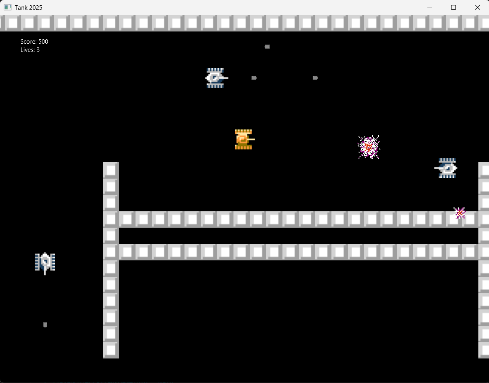

# Tank 2025

**Tank 2025** is a 2D tank action game developed using Java 8 and JavaFX. The player controls a tank to defeat enemy tanks and navigate through obstacles. The game features AI-controlled enemies, collision detection, and a scrolling camera system.

---

## 🎮 Features

- **Player Tank Controls:** Arrow keys for movement, `X` to shoot.
- **Enemy Tank AI:** Randomly moving enemies that shoot at the player.
- **Walls & Obstacles:** Collision detection for realistic gameplay.
- **Score and Lives System:** Gain points by destroying enemies, lose lives when hit.
- **Pause & Restart:** `P` to pause, `R` to restart, `ESC` to exit.
- **Camera System:** Follows the player across the map.

---

## 🛠 Requirements

- **Java 8 JDK** (JavaFX is bundled with JDK 8)